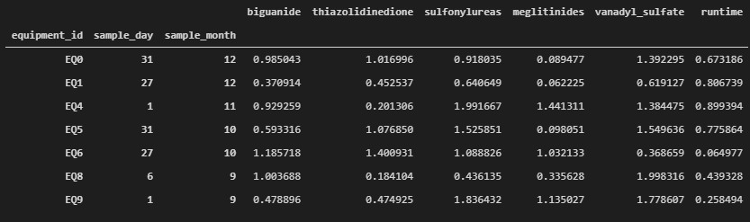
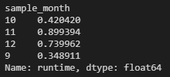

Welcome to the CMC Data Engineering Tech Exercise. We hope you'll enjoy completing it just as much as we've enjoyed doing it for you. Please bare in mind what's most important for us is understanding how you go about problem solving.

Giving just the precise answer or just the adequate code is sufficient, but you can also write an explanation of your solution or strategy, including diagrams, prints, or whatever you see fit. Your repo should be a clone of this one.

Optionally, you can simply send us your solutions by email. Either way, you'll get a chance to add/comment on your solution on the next interview.


Wishing you the best of lucks,
Grateful for your time so far,

**The NN CMC Data Foundation Team**


Should you have any questions, please contact Diogo at 31443612.

## exercise 1 DevOps
### exercise 1.1 SSH Clone

A team of chemists needs you to securely clone this repo with an SSH key. Show that you've successfuly cloned and pushed to your cloned public repo by sending us its url. 

*your explanation goes here, include prints wherever you find it appropriate*
1. Created a public and private key in the .ssh directory

`ssh-keygen -o -t rsa -C “laura.andrea.paz@gmail.com”`
2. Copied the generated public key and added it to GitHub (Settings > SSH and GPG keys)
3. Forked the original repo (instead of cloning, to have a separate copy)

https://github.com/LauraPaz/cmc_dataeng_internship_exercise

`git clone git@github.com:LauraPaz/cmc_dataeng_internship_exercise.git`

Links consulted:
* https://www.theserverside.com/blog/Coffee-Talk-Java-News-Stories-and-Opinions/github-clone-with-ssh-keys
* https://docs.github.com/en/authentication/connecting-to-github-with-ssh/testing-your-ssh-connection

### exercise 1.2 Git Ops

The branching policy requires that you branch ``main`` to `dev`, and `dev` to feature branches `exercise21`, `exercise22` and `readme` (see image below).

```
main
│
╰─ dev
    │
    ├─ readme
    ├─ exercise21
    ╰─ exercise22
```

Develop the solution to exercise **2.1** in the ``exercise21`` branch. Commit , push and merge with `dev`. Branch to `exercise22`, develop the solution to exercise **2.2** and repeat the proccess. Don't forget not to delete the branches, we'll be looking at them.

When merging from `exercise22` to `dev`, force some sort of conflict. Explain how you fixed it in the commit message. 

All your edits to this file should me made on the `readme` branch.

After you have finished your exercises, merge to `dev` and then to `main`. We'll be checking the last push before 01:10, 16-05-2021.

*your explanation goes here, include prints wherever you find it appropriate*
```
git checkout -b dev
git branch exercise21
    ...    exercise22
    ...    readme
```
Pushed branches to origin
## exercise 1.3: Packages

Deploy a python package named `cmc_dataeng_internship_<your-name>` to PyPi. We'll be running `pip install cmc_dataeng_internship_<your-name>` and executing the python package such that:

```python
>>> from cmc_dataeng_internship_<your-name> import exercise13
>>> exercise13.moto()
Coding for our patients.
```

*your explanation goes here, include prints wherever you find it appropriate or code snippets*
1. Created accounts for TestPyPi and PyPi
2. Created a project with the following structure
```
│
├─ README.md
├─ LICENSE
├─ setup.py
╰─ src
    ╰─ cmc_dataeng_internship_laura_paz
        ├─ __init__.py
        ╰─ exercise13.py
```
File exercise13.py contains the desired behaviour
3. Generated the distribution files and installed the package on my local machine to test the result
```
python3 -m pip install setuptools wheel
python3 setup.py sdist bdist_wheel
pip install -e .
```
4. Published the package to TestPyPi and tested it from a virtual environment
```
python3 -m twine upload --repository testpypi dist/*
pip install -i https://test.pypi.org/simple/ cmc_dataeng_internship_laura_paz
```
5. Repeated the previous step, in PyPi

Links consulted:
* https://realpython.com/pypi-publish-python-package/#prepare-your-package-for-publication
* https://towardsdatascience.com/how-to-publish-a-python-package-to-pypi-7be9dd5d6dcd
## exercise 2 Data Analytics
 You'll find a simple pandas exercise in `data_analytics.py`. The code you find is to be left untouched. You should replace only the lines where you read `# your solution here`. As a hint, your `equipment_measures` dataset could look something like this:

 
 
 to which the runtime averages would be:
 
 

 *your explanation goes here, include prints wherever you find it appropriate or code snippets*
### 2.1
1. Left join on the index (could also concat)
2. Fill new column 'equipment_id' using the index
3. Create a multiindex that matches the following code (loc)
### 2.2
1. Filter out the measurements that don't match the given condition
2. Get the average runtime grouping the filtered dataframe by month